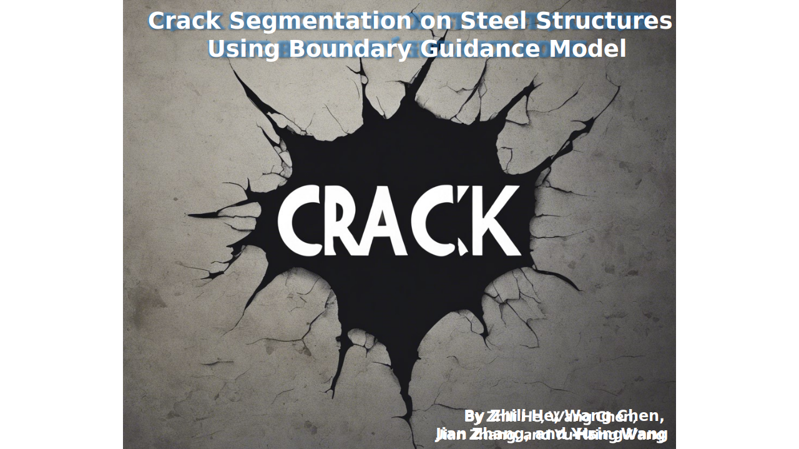

<div align="center">
<!--    -->
  
</div>

# BGCrack
This repository is the official PyTorch implementation of the **B**oundary **G**uidance **Crack** Segmentation Model **(BGCrack)**.

### 🍇 Paper:
- The initial version of the paper can refer to the [arXiv version](https://arxiv.org/abs/2306.09196) or [ResearchGate](https://www.researchgate.net/publication/371606182_Infrastructure_Crack_Segmentation_Boundary_Guidance_Method_and_Benchmark_Dataset).  
Title: **Infrastructure Crack Segmentation: Boundary Guidance Method and Benchmark Dataset**

### 🍎 Dataset:
- The Steelcrack dataset is available at [Civil-dataset](https://github.com/hzlbbfrog/Civil-dataset).

## 🛴 Updates
- **`2023/06/15`**: The preprint of our paper has been submitted to arXiv. Link → [Arxiv Paper](https://arxiv.org/abs/2306.09196).
- **`2023/05/10`**: **CSNSS** is renamed to **BGCrack**.
- **`2022/10/17`**: This repository is built up! Its previous name is [**CSNSS** (Crack Segmentation Network for Steel Structures)](https://github.com/hzlbbfrog/CSNSS).

## 🚀 Getting Started

### 1. Requirements
~~~
Recommended versions are
    * python = 3.8.15
    * pytorch = 1.12.1
    * CUDA 11.6.2 and CUDNN 8.6.0  
Other requirements can be found in Requirements.txt.
~~~

### 2. Installation
```bash
git clone https://github.com/hzlbbfrog/BGCrack
cd BGCrack
pip install -r Requirements.txt
```
Or, you can directly "Download ZIP".

### 3. Prepare the dataset

### 4. Training and validation

### 5. Test

## 🎯 Method

## :medal_military: Results on Steelcrack dataset
| **Method**                 | **mi IoU (%)** | **mi Dice (%)** | **#Param. (M)** |**MACs (G)** |
|:---------------------------|:--------------:|:---------------:|:---------------:|:-----------:|
| **U-Net**                  | 68.49          | 75.13           | 7.77            | 55.01       |
| **U-Net++**                | 72.23          | 78.37           | 9.16            | 138.63      |
| **Attention U-Net**        | 71.25          | 77.54           | 34.88           | 266.54      |
| **CE-Net**                 | 76.00          | 81.54           | 29.00           | 35.60       |
| **DeepLabv3+ (MobileNetv2)** | 68.22        | 71.07           | 5.81            | 29.13       |
| **DeepLabv3+ (Xception)**    | 67.40        | 71.48           | 54.70           | 83.14       |
| **DeepLabv3+ (ResNet-101)**  | 69.04        | 69.45           | 59.34           | 88.84       |
| **SCRN**                   | 73.23          | 78.91           | 25.23           | 31.92       |
| **TransUNet**              | 64.34          | 72.55           | 67.87           | 129.96      |
| **CrackSeU-B**             | 70.42          | 80.50           | 3.19            | 11.22       |
| **CrackSeU-L**             | 71.66          | 81.24           | 4.62            | 28.22       |
| **DconnNet**               | 74.73          | 83.40           | 28.38           | 24.79       |
| **BGCrack V1**             | 77.16          | 85.33           | 2.32            | 15.76       |

## Acknowledgements
