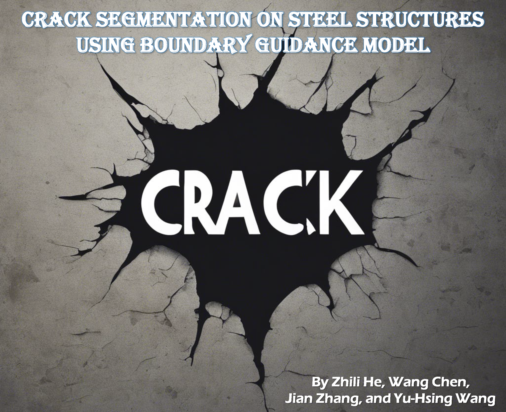
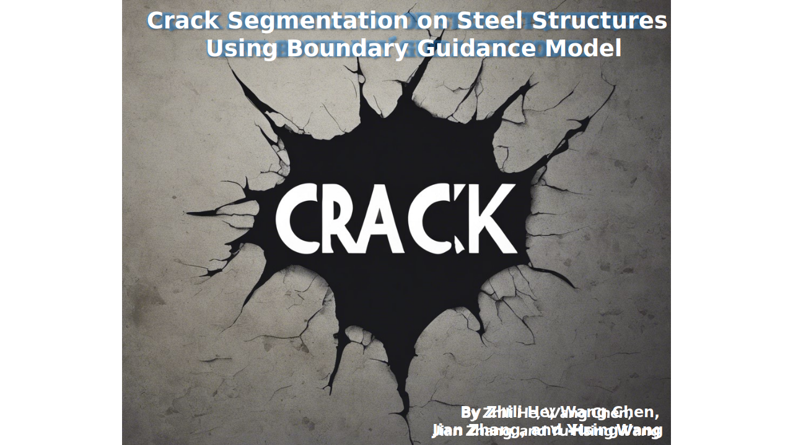

<div align="center">
<!--    -->
  
</div>

# BGCrack
This repository is the official PyTorch implementation of the **B**oundary **G**uidance **Crack** Segmentation Model **(BGCrack)**.  
**The code will be released when we finish the follow-up work**.

### 🍇 Paper:
- The initial version of the paper can refer to the [arXiv version](https://arxiv.org/abs/2306.09196) or [ResearchGate](https://www.researchgate.net/publication/371606182_Infrastructure_Crack_Segmentation_Boundary_Guidance_Method_and_Benchmark_Dataset).  
Title: **Infrastructure Crack Segmentation: Boundary Guidance Method and Benchmark Dataset**

### 🍎 Dataset:
- The Steelcrack dataset is available at [Civil-dataset](https://github.com/hzlbbfrog/Civil-dataset).

## 🛴 Updates
- **`2024/03/06`**: 🥂🥂 The paper is available online! Link → [Journal Paper](https://www.sciencedirect.com/science/article/pii/S0926580524000906).
- **`2024/02/27`**: :partying_face::partying_face: Our paper, **Crack segmentation on steel structures using boundary guidance mode**, is accepted by **Automation in Construction** after undergoing a review process lasting 8 months!
- **`2023/06/15`**: The preprint of our paper has been submitted to arXiv. Link → [Arxiv Paper](https://arxiv.org/abs/2306.09196).
- **`2023/05/10`**: **CSNSS** is renamed to **BGCrack**.
- **`2022/10/17`**: This repository is built up! Its previous name is [**CSNSS** (Crack Segmentation Network for Steel Structures)](https://github.com/hzlbbfrog/CSNSS).

## 🚀 Getting Started

### 1. Requirements
~~~
Recommended versions are
    * python = 3.8.15
    * pytorch = 1.12.1
    * CUDA 11.6.2 and CUDNN 8.6.0  
Other requirements can be found in requirements.txt.
~~~

### 2. Installation
```bash
git clone https://github.com/hzlbbfrog/BGCrack
cd BGCrack
pip install -r requirements.txt
```
Or, you can directly "Download ZIP".

### 3. Prepare the dataset
Download the dataset from [Civil-dataset](https://github.com/hzlbbfrog/Civil-dataset) and organize the folder structure as follows:
```
BGCrack/
├── Dataset/
│   ├── Steelcrack/
│   │   ├── Train/
│   │   │   ├── images/
│   │   │   ├── masks/
│   │   │   └── edges/
│   │   ├── Validation/
│   │   │   ├── images/
│   │   │   ├── masks/
│   │   │   └── edges/
│   │   ├── Test/
│   │   │   ├── images/
│   │   │   ├── masks/
│   │   │   └── edges/
```

### 4. Training and validation
To train the BGCrack model, run the following command:
```bash
python train_BGCrack_2024.py --dataset=steel_cracks_with_edge --modelname=BGCrack --batchsize=9 --epoch=70 --lr=0.006
```
Logs and model checkpoints will be created in `./Result_log` and `./Checkpoints/` respectively.

### 5. Test
To evaluate the model, run the testing script (replace `<YOUR_TEST_EPOCH>` with the specific epoch you want to evaluate):
```bash
python test_BGCrack_2024.py --dataset=steel_cracks_with_edge --modelname=BGCrack --test_epoch=<YOUR_TEST_EPOCH>
```

## 🎯 Method
BGCrack (Boundary Guidance Crack Segmentation Model) is designed for crack segmentation on steel structures. It features modules for boundary guidance to explicitly incorporate crack edge information, leading to precise crack delineation. The model integrates deep feature extraction mechanisms like MobileViT and attention gates.

## :medal_military: Results on Steelcrack dataset
| **Method**                 | **mi IoU (%)** | **mi Dice (%)** | **#Param. (M)** |**MACs (G)** |
|:---------------------------|:--------------:|:---------------:|:---------------:|:-----------:|
| **U-Net**                  | 68.49          | 75.13           | 7.77            | 55.01       |
| **U-Net++**                | 72.23          | 78.37           | 9.16            | 138.63      |
| **Attention U-Net**        | 71.25          | 77.54           | 34.88           | 266.54      |
| **CE-Net**                 | 76.00          | 81.54           | 29.00           | 35.60       |
| **DeepLabv3+ (MobileNetv2)** | 68.22        | 71.07           | 5.81            | 29.13       |
| **DeepLabv3+ (Xception)**    | 67.40        | 71.48           | 54.70           | 83.14       |
| **DeepLabv3+ (ResNet-101)**  | 69.04        | 69.45           | 59.34           | 88.84       |
| **SCRN**                   | 73.23          | 78.91           | 25.23           | 31.92       |
| **TransUNet**              | 64.34          | 72.55           | 67.87           | 129.96      |
| **CrackSeU-B**             | 70.42          | 80.50           | 3.19            | 11.22       |
| **CrackSeU-L**             | 71.66          | 81.24           | 4.62            | 28.22       |
| **DconnNet**               | 74.73          | 83.40           | 28.38           | 24.79       |
| **BGCrack V1**             | 77.16          | 85.33           | 2.32            | 15.76       |

## 🥰 Cite BGCrack!
If you have any problems, please do not hesitate to contact us!
You are very welcome to cite our paper!  
The BibTeX entry of the paper is as follows:
```BibTeX
@article{BGCrack,
title = {Crack segmentation on steel structures using boundary guidance model},
journal = {Automation in Construction},
volume = {162},
pages = {105354},
year = {2024},
issn = {0926-5805},
doi = {https://doi.org/10.1016/j.autcon.2024.105354},
url = {https://www.sciencedirect.com/science/article/pii/S0926580524000906},
author = {Zhili He and Wang Chen and Jian Zhang and Yu-Hsing Wang},
keywords = {Crack inspection, Deep learning, Boundary guidance method, Benchmark dataset}
}
```

## 🌹 Acknowledgements
This repo benefits from [SCRN](https://github.com/wuzhe71/SCRN) and [FcaNet](https://github.com/cfzd/FcaNet).
Thanks for their wonderful works!
