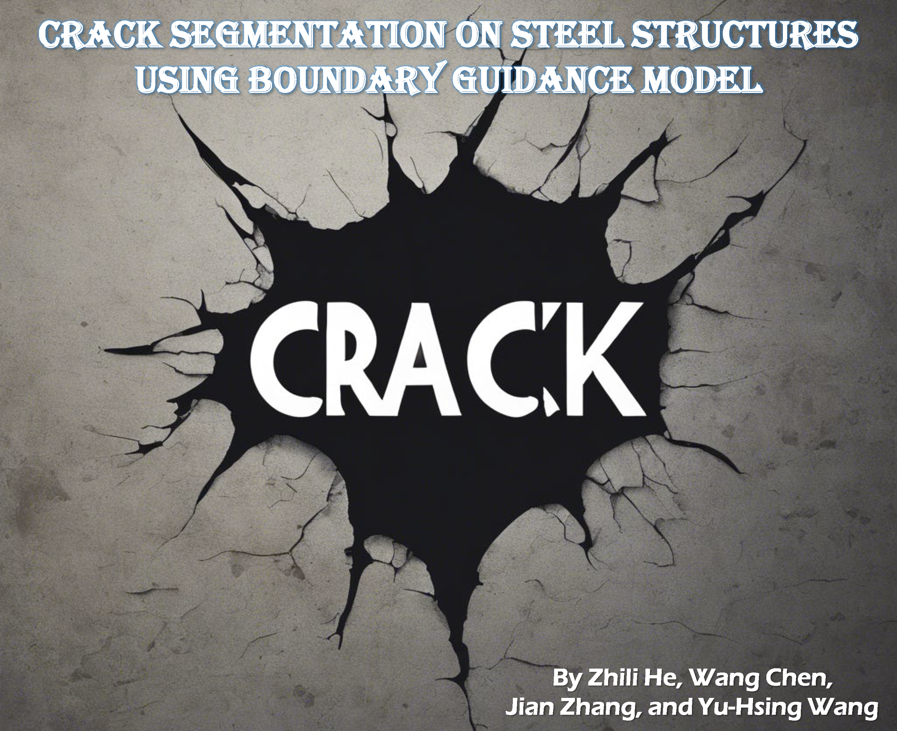

<div align="center">
<!--    -->
  
</div>

# BGCrack
This repository is the official PyTorch implementation of the **B**oundary **G**uidance **Crack** Segmentation Model **(BGCrack)**.

### 🍇 Paper:
- The initial version of the paper can refer to the [arXiv version](https://arxiv.org/abs/2306.09196) or [ResearchGate](https://www.researchgate.net/publication/371606182_Infrastructure_Crack_Segmentation_Boundary_Guidance_Method_and_Benchmark_Dataset).  
Title: **Infrastructure Crack Segmentation: Boundary Guidance Method and Benchmark Dataset**

### 🍎 Dataset:
- The Steelcrack dataset is available at [Civil-dataset](https://github.com/hzlbbfrog/Civil-dataset).

## 🛴 Updates
- **`2023/06/15`**: The preprint of our paper has been submitted to arXiv. Link → [Arxiv Paper](https://arxiv.org/abs/2306.09196).
- **`2023/05/10`**: **CSNSS** is renamed to **BGCrack**.
- **`2022/10/17`**: This repository is built up! Its previous name is [**CSNSS** (Crack Segmentation Network for Steel Structures)](https://github.com/hzlbbfrog/CSNSS).

## 🚀 Getting Started

### 1. Requirements
~~~
Recommended versions are
    * python = 3.8.15
    * pytorch = 1.12.1
    * CUDA 11.6.2 and CUDNN 8.6.0  
Other requirements can be found in Requirements.txt.
~~~

### 2. Installation
```bash
git clone https://github.com/hzlbbfrog/BGCrack
cd BGCrack
pip install -r Requirements.txt
```
Or, you can directly "Download ZIP".

### 3. Prepare the dataset

### 4. Training and validation

### 5. Test

## 🎯 Method

## Acknowledgements
